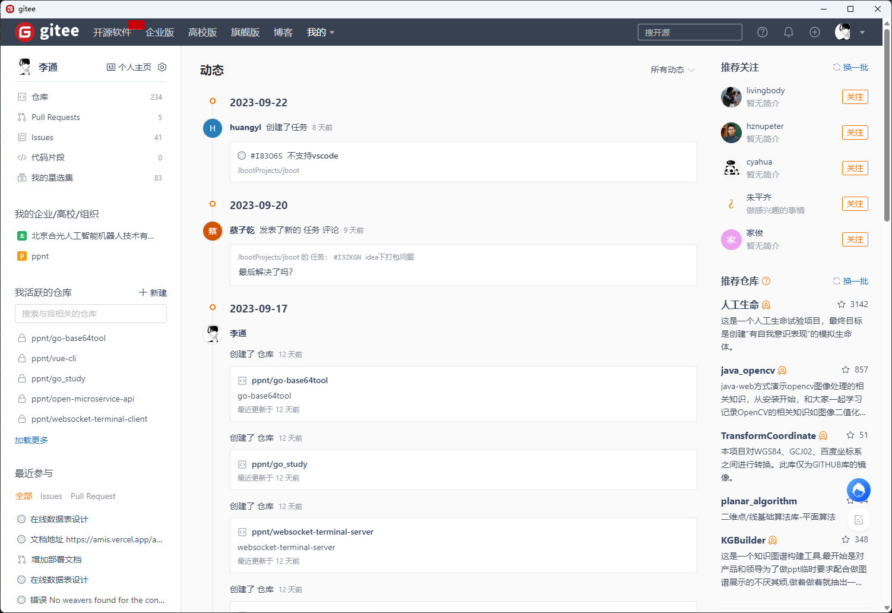

# Tauri-Gitee Desktop App
[English](readme.md)| [中文](readme_cn.md)

[](https://github.com/litongjava/tauri-gitee/stargazers)
[](https://github.com/litongjava/tauri-gitee/issues)

Tauri-Gitee is a desktop application for http://gitee.com, encapsulated using [Tauri](https://tauri.studio/) and the Rust language. Access Gitee directly from your desktop without the need for a browser.




## Features

- Fast and lightweight
- High performance and security with the Rust language
- Seamless integration with the desktop environment
- Enhanced security and stability with Tauri

## Getting Started

### Download and Installation

**Download from Releases**: You can directly download the latest version of the application from the [Releases page](https://github.com/litongjava/tauri-gitee/releases).

### Build on Your Own
**Build on Your Own**:
   - Clone this repository:
     ```bash
     git clone https://github.com/litongjava/tauri-gitee.git
     ```
   - Navigate into the project directory:
     ```bash
     cd tauri-gitee
     ```
   - Install dependencies and run with Cargo:
     ```bash
     # Install dependencies
     cargo build

     # Run the application
     cargo run
     ```

**Packaging the Application**
```bash
cargo tauri build
```

## Contributing

We welcome contributions of any kind! Whether it's reporting bugs, suggesting improvements, or requesting new features, we appreciate it all.

## License

This project is licensed under the MIT License. For more details, see the [LICENSE](./LICENSE) file.
